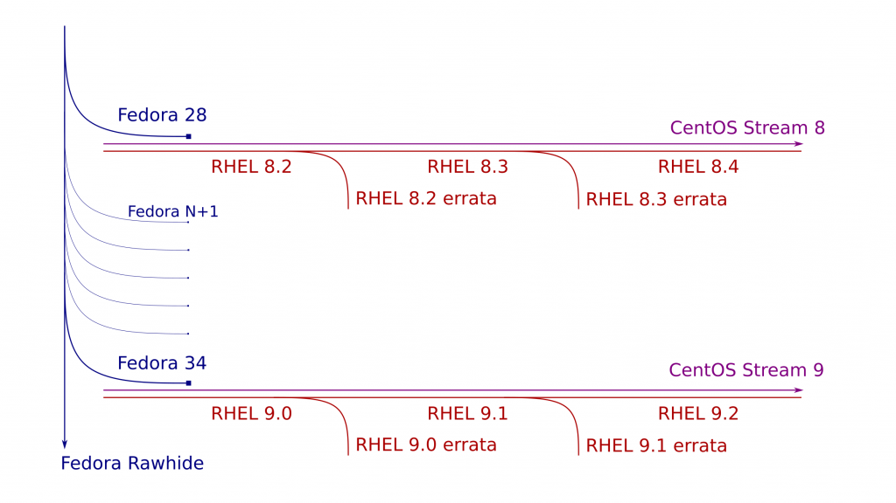

class: center, middle

# CentOS-Abkündigung

---

## Was ist passiert?

- Im Dezember 2020 wurde die **Einstellung** der CentOS-Distribution bekanntgegeben
- EL7 wird bis 2024 gepflegt, EL8 nur bis Ende 2021 (*statt Mai 2029*)
- Als Alternative wurden RHEL bzw. **CentOS Stream** genannt
--

- CentOS-Team hatte (*laut Board*) keinen nennenswerten Einfluss.red[*]
- Verkaufszahlen waren "*kein Motivator*"
- CentOS Stream sollte gepusht werden um die Entwicklung zu beschleunigen

.footnote[.red.bold[*] siehe [Interview mit CentOS Board-Mitglied Brian Exelbierd](https://arstechnica.com/gadgets/2021/01/on-the-death-of-centos-red-hat-liaison-brian-exelbierd-speaks/)]

---

## CentOS Stream

- 2019 eingeführtes neues Projekt
- Rolling Release-Modell
- Positioniert sich **zwischen** Fedora und RHEL
- **Upstream** für nächstes RHEL Minor-Release (*z.B. 8.x*)
- weniger stabil als RHEL, jedoch stabiler als Fedora
  - kein Bleeding Edge wie bei anderen Rolling Release-Distributionen (*z.B. ArchLinux, openSUSE Tumbleweed*)
--

- Für Entwicklungs- und Testzwecke unproblematisch
- Wenn Bugkompatiblität zu RHEL benötigt wird jedoch **ungeeignet**

---

class: center, middle

Quelle: [CentOS-Webseite](https://seven.centos.org/)

---

## Geschichte

- **2004**: Projekt von **Gregory Kurtzer** als binärkompatibler RHEL-Klon gestartet (**Downstream**)
- **2005**: CentOS ist so populär, dass es von Suchmaschinen **vor** RHEL angezeigt wird; RHEL bittet um Entfernung von Markenzeichen
  - Community weigert sich [und trollt Red Hat](https://tech.slashdot.org/story/05/03/02/1739228/centos-40-released)
  - Red Hat setzt Anwälte an
  - Kurtzer verlässt kurzerhand das Projekt
--

- **2014**: CentOS wird Bestandteil von Red Hat, 4 Entwickler werden angestellt
  - Red Hat verspricht **keine drastischen** Änderungen vorzunehmen
- **2019**: CentOS Stream vorgestellt

???

- Alle Vorkommnisse von Red Hat wurden durch PNAELV (*Prominent North American Enterprise Linux Vendor*) ersetzt
- Projekt hatte Höhen und Tiefen, Dramen durch unwillige Community-Mitglieder
- Seit Übernahme von Red Hat stabilere Prozesse
