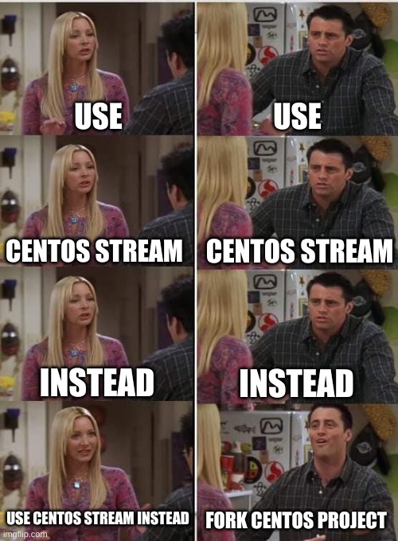
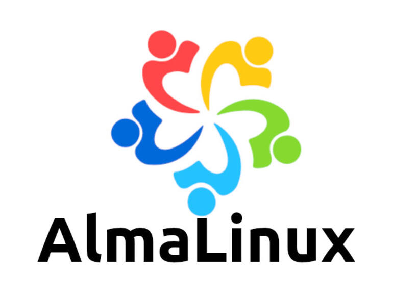
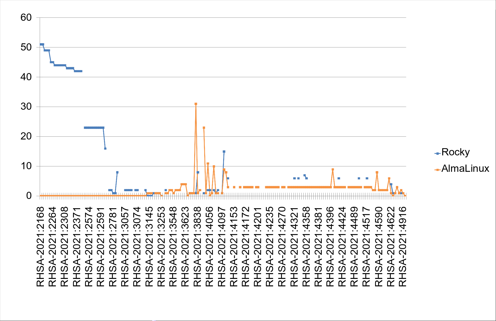

class: center, middle

# Aktuelle Entwicklungen

---

## Red Hat lenkt ein

Community reagierte.red[*] ablehnend, lenkte Red Hat ein:

- **Red Hat Developer Subscription** wird erweitert:
  - bis zu 16 Systeme
  - auch ausdrücklich Produktion und Cloud-Nutzung erlaubt
  - kein Support-Anspruch
  - Red Hat Kundenkonto benötigt
- Lösung nur für kleinere Kund:innen anwendbar

.footnote[.red.bold[*] siehe z.B. [folgende Petition](https://www.change.org/p/centos-governing-board-do-not-destroy-centos-by-using-it-as-a-rhel-upstream) oder [centos.rip](https://centos.rip)]

???

Die Petition erreicht in kurzer Zeit 10.000 Unterschriften

---

## Red Hat lenkt ein

- Neu ist auch die **Developer Subscription for Teams**:
  - bis zu 25.000 Systeme
  - ausschließlich für Entwicklungssysteme
  - Beantragung über **Sales Associate**
  - Gegen **Aufpreis** auch Support
--

- Nur für Kund:innen anwendbar, die **reine Entwicklungsumgebungen** auf CentOS betrieben haben

---

## Forks

.left-column[

Innerhalb weniger Tage entstanden mehrere Projekte:

- [Rocky Linux](https://rockylinux.org/)
- [AlmaLinux](https://almalinux.org/) (*Codename Lenix*)
- [Navy Linux](https://www.Navy Linux.org/)

]

.right-column[



]

---

## Rocky Linux.red[*]

.left-column75[

- Von **Gregory Kurtzer** erstellter CentOS-Fork
- 100% Bug-kompatibel mit RHEL
- `x86_64` und `aarch64`-Architekturen
- Unabhängige gemeinnützige Organisation (*RESF*), spendenfinanziert
  - Darf laut **Linux Foundation** offiziell den Namen **Linux** tragen

.footnote[.red.bold[*] Rocky McGaugh (†), erstellte die ersten CentOS-Builds]

]

.right-column25[


]

???

- **R**ocky **E**nterprise **S**oftware **F**oundation

---

## Rocky Linux.red[*]

.left-column75[

- [Communitysatzung](https://forums.rockylinux.org/t/community-charter/1933) und [bessere Struktur](https://forums.rockylinux.org/t/organizational-structure/1932) soll Probleme verhindern
- Build-Infrastruktur u.a. auf AWS
- RC erschien Ende April auf Basis von 8.3
- Stabile Version im **Juni** erschienen (*8.4*)

]

.right-column25[


]

???

- **R**ocky **E**nterprise **S**oftware **F**oundation

---

## AlmaLinux.red[*]

.left-column75[

- Von [CloudLinux](https://www.cloudlinux.com/) erstellter RHEL-Fork
  - Distributor und Hoster
  - Hat mit [CloudLinux OS](https://www.cloudlinux.com/all-products/product-overview/cloudlinuxos) schon einen kommerziellen RHEL-Fork erstellt
- 100% Bug-kompatibel mit RHEL
- zuerst `x86_64`-only, mit 8.4 kam auch `aarch64`

.footnote[.red.bold[*] lateinisch für Seele]

]

.right-column25[



]

???

- CloudLinux OS = speziell auf Hosting angepasster Fork mit Eigenentwicklungen (*z.B. Management-Panel-Integration, etc.*)

---

## AlmaLinux.red[*]

.left-column75[

- Hersteller gibt an jährlich **1 Million USD** in die Entwicklung zu investieren
  - "*Forever free*"
- Erstes Release am **30.03**, [Migrationsskript auf GitHub](https://github.com/AlmaLinux/almalinux-deploy) verfügbar

.footnote[.red.bold[*] lateinisch für Seele]

]

.right-column25[


]

---

## Navy Linux

.left-column75[

- Eher unbekanntes Projekt, von **Unixlab**.red[*] gegründet
- verspricht ebenfalls ein 1:1 CentOS-Klon zu sein
- Soll vollständig von einer Community gepflegt werden
  - Derzeit sollen diverse Teams gegründet werden
  - derzeit 4 Core-Mitglieder, ~80 Slack-User
- Seit Juli existiert die Non-Profit Organization **Navy Foundation**

.footnote[.red.bold[*] unklar, wer dahinter steckt]

]

.right-column25[


]

???

- Dubios, da keine Informationen über Unixlab
- Delaware Non-Profit Corporation 501c3

---

## Navy Linux

.left-column75[

- Für 8.3 existierten Pakete, aber kein Installer
- Im August erschien das erste stabile [8.4 Release](https://mirror.Navy Linux.org/Navy Linux/releases/8.4/)
- derzeit lediglich für `x86_64` verfügbar, `aarch64` und `ppc64le` jedoch [offensichtlich geplant](https://mirror.navylinux.org/selr/releases/8/)
- Zukunft fragwürdig
- Mit **SELR** ist ein EPEL.red[*]-Fork geplant
  - beinhaltet derzeit lediglich spezifische Ceph-, Docker-, Gluster-, NFS Ganesha- und Samba-Versionen

.footnote[.red.bold[*] [Extra Packages for Enterprise Linux](https://fedoraproject.org/wiki/EPEL)]

]

.right-column25[


]

???

- Dubios, da keine Informationen über Unixlab
- SELR = **S**table **E**nterprise **L**inux **R**epository

---

class: small

## Vergleich

|   | RHEL | Rocky Linux | AlmaLinux | Navy Linux |
| - | ---- | ----------- | --------- | ---------- |
| Architekturen | x86_64, aarch64, s390z, ppc64 | x86_64, aarch64 | x86_64, aarch64 | x86_64 |
| Vagrantbox | Ja | Ja | Ja | Nein |
| Verfügbare Pakete | ~6.300 | ~5.300 | ~ 5.300 | ~6.600 |
| Mirror | unbekannt (CDN) | ~90 | ~130 | 3 |
| Migration | CentOS 7/8, Oracle Linux [ab 8.3](https://bugzilla.redhat.com/show_bug.cgi?id=1944815) | [CentOS 8](https://github.com/rocky-linux/rocky-tools/tree/main/migrate2rocky) | [CentOS, RHEL, Rocky Linux, Oracle Linux](https://github.com/AlmaLinux/almalinux-deploy) | - |
| Support | Ja | unklar | in Diskussion | unklar |
| Secure Boot | Geplant | Ja | Nein | unklar |

---

## Migrationsskripte

Migration nach Rocky Linux:

```shell
# curl -LO https://raw.githubusercontent.com/rocky-linux/rocky-tools/main/
migrate2rocky/migrate2rocky.sh
# bash migrate2rocky.sh -rV
```

Migration nach AlmaLinux:

```shell
# curl -LO https://raw.githubusercontent.com/AlmaLinux/almalinux-deploy/master/
almalinux-deploy.sh
# bash almalinux-deploy.sh
```

---

## Release-Abstände

RHEL 8.4 erschien am 18.05.2021.

- AlmaLinux 8.4: 26.05.2021 (**8 Tage**)
  - `aarch64` 8.4: 30.06.2021 (**43 Tage**)
- Rocky Linux 8.4: 21.06.2021 (**34 Tage**)
- Navy Linux 8.4: 01.08.2021 (**75 Tage**)

---

## Update-Zyklen

- Den meisten Anwender:innen sind schnell veröffentlichte Patches wichtig
  - Wie **schnell** sind die jeweiligen Forks?
- Auswertung über die letzten **~2,5 Monate** (*01.06-17.08.2021*)
--

- Für den Vergleich wurden die folgenden **Quellen** herangezogen:
  - [Red Hat Security Advisories](https://access.redhat.com/security/security-updates/)
  - [RockyLinux Errata](https://errata.rockylinux.org/)
  - [AlmaLinux Errata](https://errata.almalinux.org/)
- Navy Linux stellt derzeit keine Errata-Informationen zur Verfügung
- Die vollständige tabellarische Auswertung ist hier zu finden: [[klick!]](https://github.com/stdevel/froscon2021-wtfaq-centos/blob/main/errata_drift.xlsx)

???

- Sicherheitsfixes für OS ohne aufpreispflichtige Erweiterungen (*HA, Realtime, Cluster*)

---



???

- AlmaLinux liefert sehr schnell
  - offensichtlich kleiner Fehler in den Metadaten
- Rocky Linux hatte anfangs große Probleme zeitnah zu liefern
  - Lücken in Errata

---

class: small

## Update-Zyklen

.left-column[

- AlmaLinux liefert i.d.R. am **gleichen** oder nächsten Tag 🚀
- Rocky Linux hatte bis **Mitte Juli** deutliche **Probleme** Patches zeitnah bereitzustellen
  - seitdem werden Patches spätestens am (*über*)nächsten Tag ausgeliefert
  - Errata-Pipeline anscheinend noch [nicht ausgereift](https://forums.rockylinux.org/t/some-errata-missing-in-comparison-with-rhel-and-almalinux/)
- nicht jeder Patch wird von den Forks nachgebaut
- **1** RHEL-Patch von Rocky Linux, aber nicht von AlmaLinux ausgeliefert:
  - [RHSA-2021:3152](https://access.redhat.com/errata/RHSA-2021:3152) (*exiv2, Exif metadata library*)

]

.right-column[

- **9** Patches von AlmaLinux, aber nicht von Rocky Linux ausgeliefert:
  - [RHSA-2021:2566](https://access.redhat.com/errata/RHSA-2021:2566) (*`fwupd`*)
  - [RHSA-2021:2743](https://access.redhat.com/errata/RHSA-2021:2743) (*Firefox*)
  - [RHSA-2021:2988](https://access.redhat.com/errata/RHSA-2021:2988) (*`varnish`*)
  - [RHSA-2021:3020](https://access.redhat.com/errata/RHSA-2021:3020) (*Ruby 2.7*)
  - [RHSA-2021:3027](https://access.redhat.com/errata/RHSA-2021:3027) (*`microcode_ctl`*)
  - [RHSA-2021:3066](https://access.redhat.com/errata/RHSA-2021:3066) (*`edk2`, QEMU UEFI*)
  - [RHSA-2021:3075](https://access.redhat.com/errata/RHSA-2021:3075) (*`libuv`, async I/O*)
  - [RHSA-2021:3076](https://access.redhat.com/errata/RHSA-2021:3076) (*`go-toolset`*)
  - [RHSA-2021:3079](https://access.redhat.com/errata/RHSA-2021:3079) (*`389-ds`*)

]
