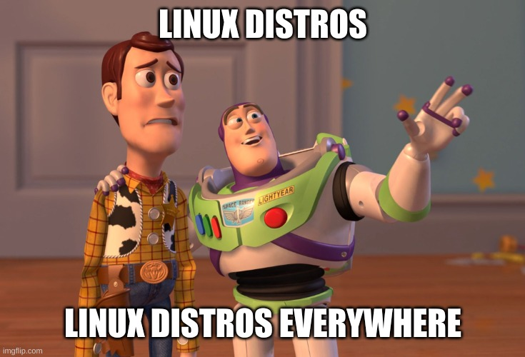

class: center, middle

# Alternativen

---

## Oracle Linux

.left-column75[

- Seit 2006 von Oracle gepflegte Enterprise Linux-Distribution
- bietet **optionalen** Linux-Kernel mit Oracle-Anpassungen
- [Migrationsskript](https://github.com/oracle/centos2ol) auf GitHub verfügbar
  - Unterstützt CentOS 6 bis 8
  - CentOS Stream wird **nicht** unterstützt

]

.right-column25[

]

---

## Oracle Linux

.left-column75[

- **Vorteile**
  - Binärkompatibel, gleiche Code-Basis
  - geringerer Migrationsaufwand
- **Nachteile**
  - Nur für `x86_64` und `aarch64` erhältlich
  - Zukunft fragwürdig, Hersteller hat geringes OSS-Interesse.red[*]

.footnote[.red.bold[*] siehe OpenSolaris, Java, OpenOffice,...]

]

.right-column25[

]

???

- CentOS 8 ist auch für `ppc64le` erhältlich

---

## openSUSE

.left-column75[

- Seit 2006 von der Community gepflegte Distribution
  - 4 von 6 Board-Mitgliedern gehören **nicht** zu SUSE
- Basis für kommerzielles **SUSE Linux Enterprise**
- In zwei Editionen verfügbar:
  - **Leap** - stabil, Upstream.red[*] zu SLE
  - **Tumbleweed** - Rolling Release, Entwicklerversion
- Support unterstützt Migration von Leap zu SLES

.footnote[.red.bold[*] zu ~90% zutreffend, in [15.3](https://www.suse.com/c/how-suse-builds-its-enterprise-linux-distribution-part-5/) wurde der Build-Prozess weiter vereinheitlicht]

]

.right-column25[

]

---

## openSUSE

.left-column75[

- **Vorteile**
  - gleiches Paketformat
  - aktives Projekt mit hohem Community-Gedanken
- **Nachteile**
  - andere Distribution, Umgewöhnung notwendig
  - kurze Wartungszeit (18 Monate.red[*])
  - häufigere Upgrades notwendig

.footnote[.red.bold[*] Minor-Releases alle 12 Monate, 6 Monate Migrationszeit]

]

.right-column25[

]

---

## Ubuntu

.left-column75[

- Seit 2004 von der Community gepflegte Distribution
- basierend auf Debian-Paketformat
- **beliebteste** Distribution im Hosting, in Public Clouds und Container-Images
- Zwei Releases jedes Jahr (*.04, .10*)
  - werden **9 Monate** unterstützt
- **Long Term Support**-Release alle 2 Jahre im April, 5 Jahre Unterstützung

]

.right-column25[

]

---

## Ubuntu

.left-column75[

- Durch **Extended Security Maintenance**.red[*] sind 5 weitere Jahre möglich
- [bedeutend günstiger](https://ubuntu.com/advantage) als RHEL und SLES
  - Essential ohne Support: **225 USD** pro Host + unlimitiert VMs
  - Mit 8x5 bzw. 24x7 Support: **750 USD** bzw. **1.500 USD** pro Host + unlimitiert VMs

.footnote[.red.bold[*] ab 18.04]

]

.right-column25[

]

???

- Versionen vor 18.04: **3** Jahre ESM

---

## Ubuntu

.left-column75[

- **Vorteile**
  - kostenlos nutzbar
  - bis zu 10 Jahre lang nutzbar (*gegen Aufpreis*)
- **Nachteile**
  - anderes Paketsystem und andere Distribution, größere Umgewöhnung
  - ohne Automatismus höherer Migrationsaufwand
  - Hersteller treibt neue Ideen aggressiv voran.red[*]

.footnote[.red.bold[*] siehe [Unity](https://w.wiki/36kV), [Mir](https://w.wiki/36kW), [Snap](https://w.wiki/36kX), [netplan](https://netplan.io/), [multipass](https://multipass.run/), [Amazon Desktop-Suche](https://askubuntu.com/questions/192269/how-can-i-remove-amazon-search-results-from-the-dash-or-disable-the-feature),...]

]

.right-column25[

]
